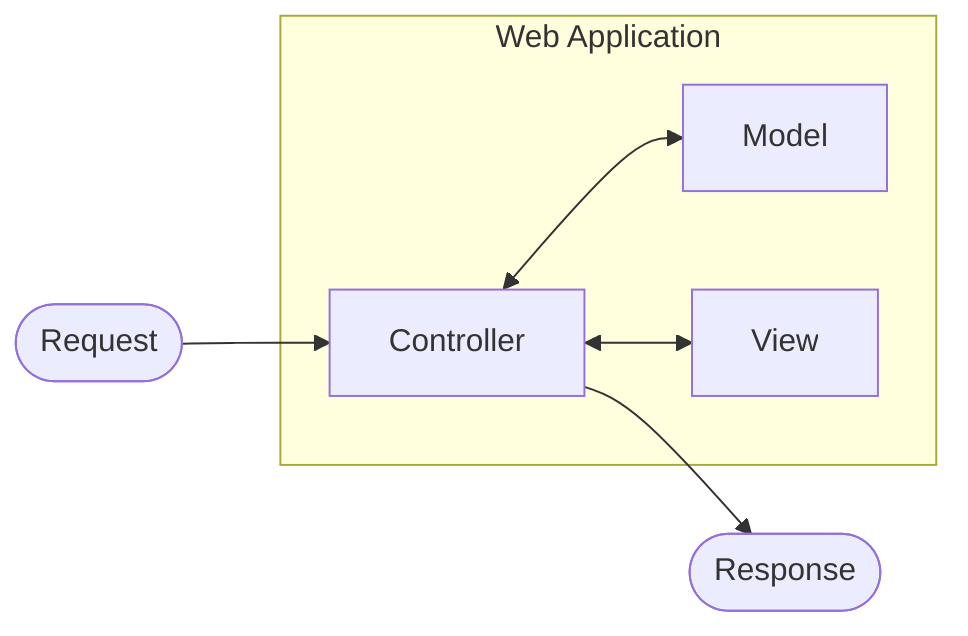
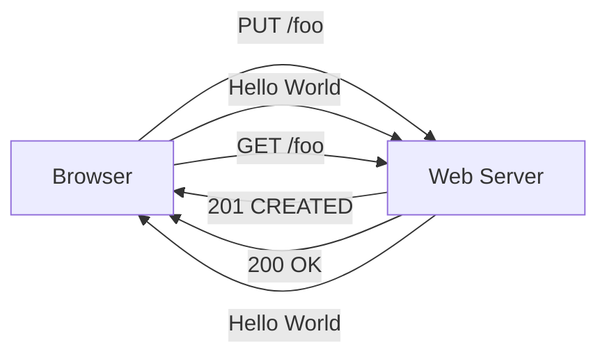

# mojo-demo

Dockerについて
```bash
# ビルドして起動（バックグラウンド）
docker compose up -d --build

# ビルドなしで起動（イメージに変更がない時）
docker compose up -d

# コンテナの中に入って調査
docker compose exec mojo-app bash

# 状態確認
docker compose ps

# ログを見る（-fでリアルタイム追尾）
docker compose logs -f mojo-app
docker compose logs -f app-db

# 停止（コンテナは残る）
docker compose stop

# 停止＋コンテナ削除（volumeは残るのでDBデータは消えない）
docker compose down

# 完全にリセットしたい時（DBデータも消える、注意）
docker compose down -v
```

MariaDBについて
```bash
# コンテナに入ってmysqlクライアントで接続
docker compose exec app-db mariadb -u appuser -p webwork_gui

# rootで入りたい場合
docker compose exec app-db mariadb -u root -p
```
```sql
-- データベース一覧
SHOW DATABASES;

-- データベース選択
USE データベース名;

-- 今のDBの中のテーブル一覧
SHOW TABLES;

-- テーブルの構造確認
DESCRIBE テーブル名;

-- テーブル作成の例
CREATE TABLE users (
    id INT AUTO_INCREMENT PRIMARY KEY,
    name VARCHAR(255) NOT NULL,
    created_at TIMESTAMP DEFAULT CURRENT_TIMESTAMP
);

-- データ挿入
INSERT INTO users (name) VALUES ('kaisei');

-- データ確認
SELECT * FROM users;

-- 抜ける
EXIT;
```
```bash
# バックアップ（ホスト側にsqlファイルとして保存）
# 現在のデータベースの状態（テーブルやデータ）を、外部ファイルとして書き出して保存すること
docker compose exec app-db mariadbdump -u root -p webwork_gui > backup.sql

# リストア
# バックアップファイルを使って、データベースを過去の状態へ復元（元に戻す）すること
docker compose exec -T app-db mariadb -u root -p webwork_gui < backup.sql
```

## [一番小さなMojoliciousアプリケーション](https://mojolicious.perlzemi.com/blog/20140325139572.html)

```perl
# Mojolicious::Liteの読み込み
# strict, warnings automatically enabled
use Mojolicious::Lite;

# ルーティングの設定
# 元はget(URL, sub)という関数
get '/' => sub {

  # コントローラオブジェクトの受け取り
  # コントローラオブジェクトの一番目の要素を削除しながら取り出す(shift)
  my $self = shift;

  # 内容の描画
  $self->render(text => 'Hello World');
};

# Mojoliciousアプリケーションの開始
app->start;
```

```bash
# アプリケーションの実行
morbo webapp.pl
```

## [パラメーターの受け取り方](https://mojolicious.perlzemi.com/blog/20140402139642.html)

### 1. URLの一部として受け取る

```perl
use Mojolicious::Lite;

# ルーティングのパターンの指定
get '/date/:date' => sub {
  my $self = shift;

  # パラメーターの受け取り
  my $date = $self->param('date');

  $self->render(text => "Data: $date");
};

app->start;
```

### 2. クエリ文字列として受け取る

/diary/?date=_date_&user=*user*にアクセス

```perl
use Mojolicious::Lite;

# ルーティングのパターンの指定
get '/diary' => sub {
  my $self = shift;

  # パラメーターの受け取り
  my $date = $self->param('date');
  my $user = $self->param('user');

  $self->render(text => "Date: $date, User: $user");
};

app->start;
```

## [Mojoliciousのテンプレートの使い方](https://mojolicious.perlzemi.com/blog/20140405139642.html)

```perl
use Mojolicious::Lite;

get '/' => sub {
  my $self = shift;

  # テンプレートの指定
  $self->render('index');
};

__DATA__

@@ index.html.ep
<html>
  <head>
    <title>Index</title>
  </head>
  <body>
    <h1>Index</h1>
  </body>
</html>
```

### **テンプレート内にPerlを書く**

一行で終わるときは先頭に%, 複数行にわたるときは<% %>
値を埋め込むときは%または<%= %>

```
@@ index.html.ep
<%
  my $name = 'kimoto';
  my $age = 19;
  my @nums = (1, 2, 3);
%>
<html>
  <head>
    <title>Index</title>
  </head>
  <body>
    <h1>Index</h1>
    % if ($name eq 'kimoto') {
      Kimoto
    % } else {
      Other
    % }
    <br />
    He is <%= $age %> years old.<br />

    % for my $num (@nums) {
      <%= $num %><br />
    % }
  </body>
</html>
```

### **データの受け渡し=スタッシュ**

```perl
# コントローラーでのスタッシュの値の設定
$c->stash('name' => 'Kimoto');

# コントローラーでのスタッシュの値の取得
my $name = $c->stash('name')

# renderメソッド
$c->render($template, 'name' => 'Kimoto', 'age' => 19);

# これと同じ
$c->stash('name' => 'Kimoto');
$c->stash('age' => 19);
$c->render($template);


# テンプレートでのスタッシュの値の設定
stash('name' => 'Kimoto');

# テンプレートでのスタッシュの値の取得
my $name = stash('name');
```

```perl
# コントローラー
get '/' => sub {
  my $self = shift;

  # スタッシュに値を設定してindexを描画
  $self->render('index', 'name' => 'Kimoto', age => 19);
};

app->start;

__DATA__

@@ index.html.ep
<%
  # スタッシュから値を取得
  my $name = stash('name');
  my $age = stash('age');
%>
<html>
  <head>
    <title>Index</title>
  </head>
  <body>
    <h1><%= $name %>:<%= $age %></h1>
  </body>
</html>
```

### レイアウト

レイアウト=同じ骨格をまとめて作る

```
@@ index.html.ep
<html>
  <head>
    <title>Index</title>
  </head>
  <body>
    <h1>Index</h1>
  </body>
</html>

@@ company/info.html.ep
<html>
  <head>
    <title>Company Information</title>
  </head>
  <body>
    Company Information
  </body>
</html>
```

骨格が似ているので...↓

```
@@ layouts/common.html.ep
<html>
  <head>
    <title><%= stash('title') %></title>
  </head>
  <body>
    %= content;
  </body>
</html>

# 第一引数にはレイアウト名、第二引数以降にはstashの値
@@ index.html.ep
% layout 'common', title => 'Index';
  <h1>Index</h1>

@@ company/info.html.ep
% layout 'common', title => 'Company Information';
  <h1>Company Information</h1>
```

### 他のテンプレートをインクルードする

headerやfooterなどの共通部品を作成できる

```HTML
<%-- @@ header.html.ep --%>
<header>
  <nav>
    <a href="/">Home</a> |
    <a href="/about">About</a>
  </nav>
</header>

<%-- @@ card.html.ep --%>
<div class="user-card">
  <h3><%= $title %></h3>
  <p>ユーザー名: <%= $user %></p>
</div>


これを使って...↓

<%-- @@ index.html.ep --%>
<html>
<body>
  %= include 'header'

  <main>
    <h1>トップページへようこそ</h1>
  </main>

  <div class="container">
  <%-- パラメータを渡して呼び出し --%>
  %= include 'card', title => '管理者情報', user => '山田太郎'

  <%-- 別の値を渡して再利用 --%>
  %= include 'card', title => '一般ユーザー', user => '鈴木花子'
</div>
</body>
</html>
```

### テンプレートの外部化

templatesディレクトリの中に\*.heml.epを配置

### テンプレートブロック

テンプレートブロック=テンプレート内で再利用可能なテンプレートの部品(ボタンなど)

```
@@ index.html.ep
<% my $button = begin %>
  % my ($class, $text) = @_;
  <button class="<%= $class %>" >
    %= $text
  </button>
<% end %>

<%= $button->('foo', 'Hello') %>
<%= $button->('goo', 'Bye') %>
```

## [アプリケーションとコントローラの機能](https://mojolicious.perlzemi.com/blog/20140409139642.html)

### アプリケーションオブジェクト

```perl
use Mojolicious::Lite;

#アプリケーションオブジェクト
my $app = app;
#コントローラでは
my $app = $c->app;

#ホームオブジェクト
my $home = $app->home;
my $path_abs = $home->rel_file('db/myapp.db')#相対パスで指定したパスを絶対パスに変換


#ログ
my $log = $app->log;
$log->debug($message);
$log->info($message);
$log->warn($message);
$log->error($message);
$log->fatal($message);


#設定ファイル
#同じ名前の設定ファイルに記述(ex. myapp.conf)
{
  name => 'kimoto',
  age => 19
}

#読み込みはConfig pluginかplugin method
plugin('Config');
# または
$app->plugin('Config');

# 取得はconfig method
my $name = $app->config('name');
my $age = $app->config('age');
```

### 静的ファイルの配置

CSSやJavaScript、imgなどの静的なファイルはpublicディレクトリに配置
->Mojoliciousによって自動的にディスパッチされる
`http://localhost:3000/css/common.css`のようなURLでこれらのファイルを取得できる
cf: テンプレートはtemplates/に配置

### リダイレクト

リダイレクト(ほかのURLに転送する機能)はMojolicious::Controllerクラスのredirect_to methodでできる
`$c->redirect_to('/other');

## [ルーティングの基礎](https://mojolicious.perlzemi.com/blog/20140412139642.html#google_vignette)

### プレースホルダー

先頭にコロン(:)をつけるとその部分はパラメーターとして取得できる。

> [!WARNING]
> プレースホルダーは`/`と`.`以外の値にマッチする
> `get '/date/:date'`には`/date/20260811/hello`や`/date/20260811.json`は成功しない
> `(:date).json`とすれば後者は成功する

- リラックスプレースホルダー
`/date/#date`とすると`.`を含んだ部分を取得できる

- ワイルドカードプレースホルダー
`/date/*date`とすると`/`を`.`を含むすべての文字を取得できる

### ルーティング
```perl
get '/' => sub { ... };
post '/' => sub { ... };
head '/' => sub { ... }; #ページの存在を確認
put '/' => sub { ... };
del '/' => sub { ... };
patch '/' => sub { ... };
any '/' => sub { ... }; #すべてのHTTPメソッドにマッチ
my $http_method = $c->req->method;
```

### not Foundを自分で処理
```perl
get '/date/:date' => sub {
  my $self = shift;
  my $date = $self->param('date');

  # 日付の形式でない場合は「404 Not Found」を描画する
  unless ($date =~ /^[0-9]{8}$/) {
    $self->reply->not_found;
    return;
  }

  $self->render('date', date => $date);
};

# 500エラーメッセージを表示
$c->reply->exception('Error');
```

### すべてのルーティングに共通する前処理
```perl
use Mojolicious::Lite;

# 前処理
under sub {
  my $self = shift;

  $self->stash('name' => 'Kimoto');

  return 1;
};

get '/some1' => sub {
  my $self = shift;

  my $name = $self->stash('name');

  $self->render(text => $name);
};

get '/some2' => sub {
  my $self = shift;

  my $name = $self->stash('name');

  $self->render(text => $name);
};

app->start;
```

## [Mojoliciousのテンプレートヘルパー](https://mojolicious.perlzemi.com/blog/20140414139745.html)
layoutヘルパー、stashヘルパーはすでに解説済み。それ以外のヘルパーについて

### スタイルシート・JavaScriptの埋め込み
テンプレートの中にスタイルシートを記述
```perl
  %= stylesheet begin
  body {
    background:blue;
  }
  %end

  %= javascript begin
    alert('Hello');
  %end

  #public/stylesheet, public/javascriptを読み込み
  %= stylesheet '/css/common.css';
  %= javascript '/js/common.js';
```
### アプリケーションオブジェクト・コントローラオブジェクトの取得
テンプレートの中では...
```perl
% my $app = app;

% my $c = $self;
```

### データのダンプ
```perl
% warn dumper $date;
```

### 他のテンプレートの取り込み
```perl
# 第二引数以降を利用することで、スタッシュの値を設定できる
%= include '/include/header.html.ep', name=>'kimoto', age=>34;
```

### URLの表現
Mojoliciousではアプリケーションの内部的なURLを表現する場合は、``url_for``ヘルパーを用いる。
```perl
<a href="<%= url_for('/date/20131215') %>">2013/12/15</a>
```
引数を指定しなければ、現在のURLを取得できる。
(クエリ文字列を除いた部分のURLを取得)
クエリ文字列を含めたURLを取得したい場合は`url_with`ヘルパーを利用する
```perl
<%= url_with %>
```

クエリの部分は`query`メソッドで取得
```perl
my $query = url_with->query;*
```

**最初のクエリ文字列がtitle=perl&name=kenだと想定**
- クエリ文字列を置き換える
```perl
$url->query(name => 'taro', price => 1900);

# 前
title=perl&name=ken
# 後
name=taro&price=1900
```

- クエリ文字列のマージ
配列のリファレンスとして渡す
```perl
$url->query([name => 'taro', price => 1900]);

# 前
title=perl&name=ken
# 後
title=perl&name=taro&price=1900
```

- クエリ文字列の追加
ハッシュのリファレンスとして渡す
```perl
$url->query({name => 'taro', price => 1900});

# 前
title=perl&name=ken
# 後
title=perl&name=ken&name=taro&price=1900
```

## [フォームの利用](https://mojolicious.perlzemi.com/blog/20140421139815.html)
タグヘルパー：フォーム送信した後でもフォームの値を復元してくれる
```perl
<form action="<%= url_for %>" method="post" style="border:1px solid gray">
# action: 処理するURL

  <b>Form</b><br>
  <b>Name:</b> <%= text_field 'name' %><br>
  #text_fieldヘルパー

  <b>Private:</b> Yes<%= radio_button private => 1 %> / No <%= radio_button private => 0, checked => 'checked' %><br>
  #radio_buttonヘルパー: 第一引数にname, 第二引数にvalue, 残りは属性

  <b>Message:</b><br>
  <%= text_area 'message', style => "width:400px; height:100px" %>
  #text_areaヘルパー

  <br>
  <input type="submit" value="Post">
</form>
```
フォームの処理
```perl
post '/' => sub {
  my $self = shift;

  # パラメーターの取得
  my $name = $self->param('name');
  my $private = $self->param('private');
  my $message = $self->param('message');

  # メッセージがない場合はトップページを表示
  unless (length $message) {
    $self->render('index', error => 'Message is empty');
    return;
  }
  # フラッシュに保存
  #フラッシュ：次の画面遷移の時まで保存されるデータ
  $self->flash(name => $name);
  $self->flash(private => $private);
  $self->flash(message => $message);

  $self->redirect_to('/');
};
```

## [Growing Mojolicious applications](https://docs.mojolicious.org/Mojolicious/Guides/Growing#NAME)

### MVC Model


The **controller** receives a request from a user, passes incoming data to the **model** and retrieves data from it, which then gets turned into an actual response by the **view**.

### REST/REpresentational State Transfer


- All resources are uniquely addressable with URLs and every resource can have differnt representations such as HTML, JSON.
- User interface concerns are separated from data storage concerns and all session state is kept client-side
- While HTTP methos are not directly part of REST, they go well with it and are commonly used to manipulate resources.

### Sessions
<div>
  <b>HTTP = stateless protocol (web servers don't know anything about previous requests)</b>
  <br>
  -> makes user-friendly login systems tricky.
  <br>
  -> <b>Sessions solve this problem</b> by allowing web applications to keep stateful information across several HTTP requests.
</div>

### Full Mojolicious applications
```
full_mojo_app/
├── full_mojo_app.yml       # 設定ファイル
├── lib/
│   ├── FullMojoApp.pm       # アプリ全体の設計図
│   └── FullMojoApp/
│       └── Controller/
│           └── Example.pm    # サンプルの処理
├── public/
│   └── index.html            # 静的ファイル置き場
├── script/
│   └── full_mojo_app          # 起動スクリプト
├── t/
│   └── basic.t                # テストコード
└── templates/
    ├── example/
    │   └── welcome.html.ep    # 表示テンプレート
    └── layouts/
        └── default.html.ep    # 共通レイアウト
```
Application skeletons can be automatically generated with the commands
```bash
mojo generate app MyApp
```